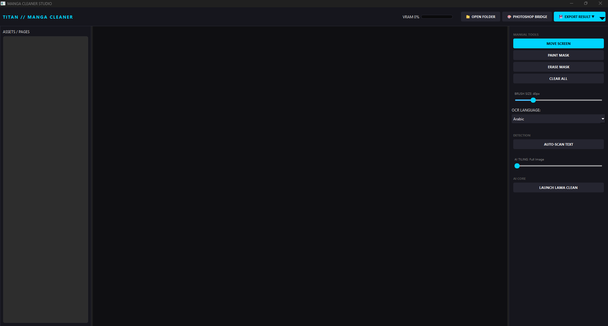
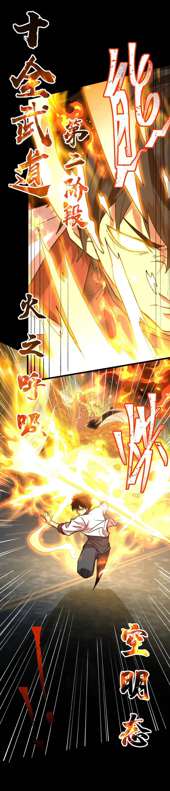

# 🌌 TITAN MANGA STUDIO v2.0.0
**High-Performance AI-Powered Manga Restoration Suite**

Titan Manga Studio is a professional desktop application engineered for high-fidelity manga scanlation and restoration. Version 2.0.0 introduces a modular architecture and a specialized tiling engine designed for 4K page processing.

## 🖥️ Studio Preview

## ⚡ Key Engineering Achievements (v2.0.0)

### 🧩 AI Tiling Engine & VRAM Optimization
Engineered a custom **Tiling Engine** to process ultra-high-resolution (4K+) images within consumer GPU VRAM limits. 
- **Gaussian Seam Blending:** Implemented alpha-weighted Gaussian blending to eliminate visual seams between processed tiles.
- **VRAM Guard:** Integrated real-time hardware telemetry to dynamically adjust tile density based on available GPU memory.

### 🧠 Modern AI Core
- **Advanced Inpainting:** Leveraging the **LaMa (Resolution-robust Fourier Inpainting)** model for high-frequency detail reconstruction.
- **Multilingual OCR:** Integrated **EasyOCR** with support for Japanese, Korean, Chinese, and English, optimized via 8-bit grayscale preprocessing.

### 🚀 Professional Architecture
- **Multi-threaded Execution:** Heavy AI inference is offloaded to **QThreads**, maintaining a consistent **60 FPS UI responsiveness** during 4K processing, (I hope😁).
- **Photoshop Bridge:** A robust COM interop bridge using `win32com` to automate professional export-to-layer workflows in Adobe Photoshop.
- **Modular Design:** Full separation of concerns using a Backend/Frontend/Utils package structure with strict Python type-hinting.

## 📸 Before & After
| Original Page | AI Cleaned Result |
| :---: | :---: |
|  |  |
|  |  |

## 🛠️ Tech Stack
- **Core:** Python 3.10+
- **Inference:** PyTorch, OpenCV, EasyOCR, SimpleLama
- **UI:** PySide6 (Qt for Python)
- **Automation:** PyWin32 (Photoshop COM API)

## ⚙️ Installation & Usage
1. Clone the repository.
2. Install dependencies: `pip install -r requirements.txt`.
3. Launch: `python main.py`.

> **Note:** CUDA-capable GPU is highly recommended for real-time 4K processing.

## only works with python 3.12 or lower ##