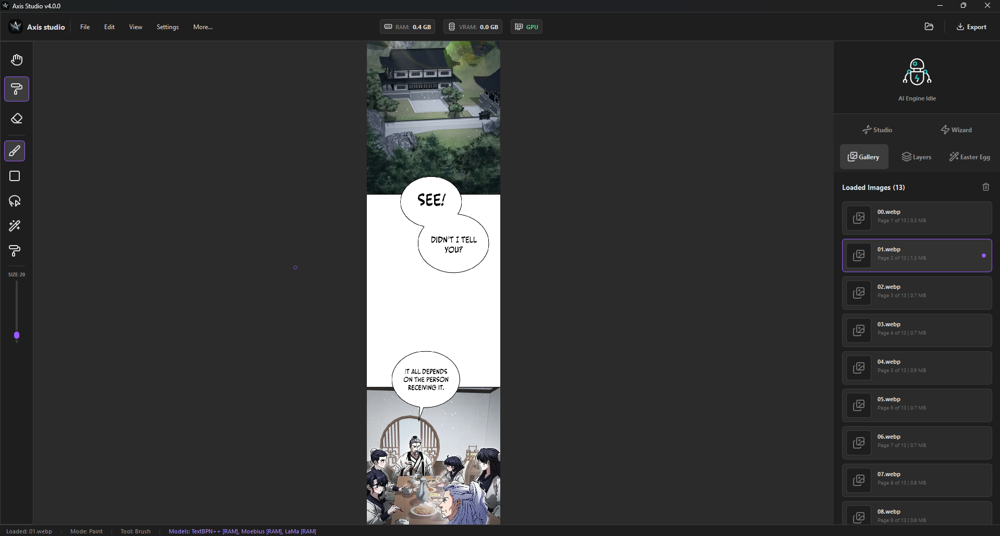
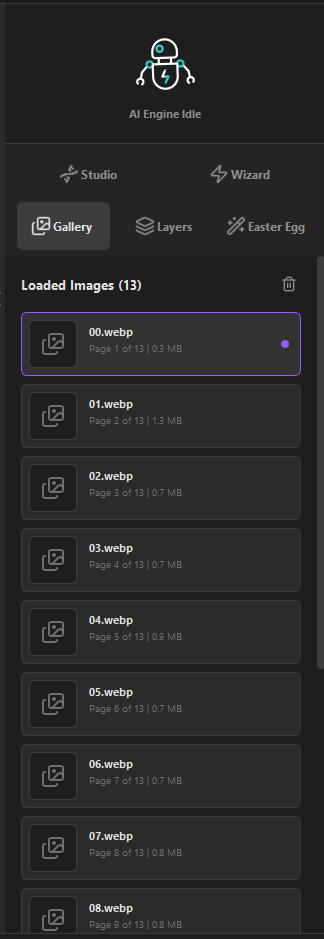
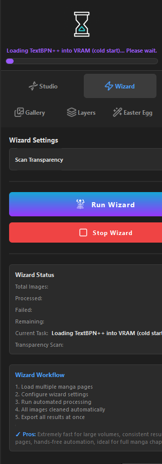
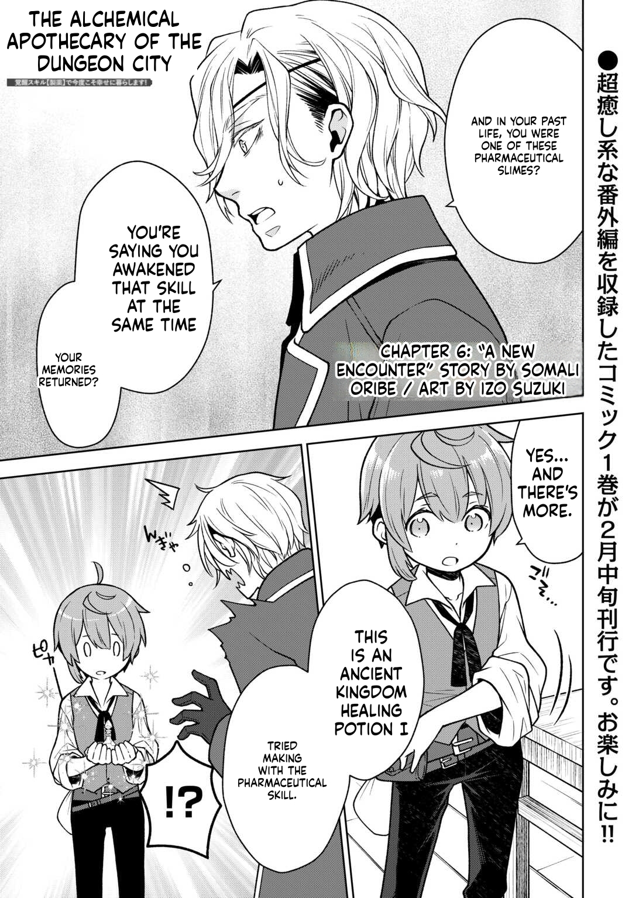
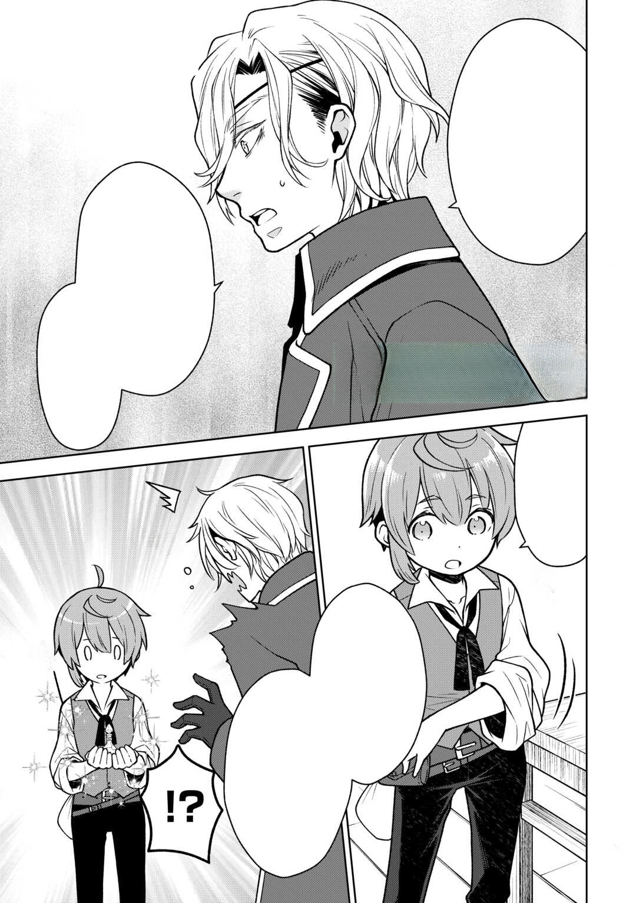
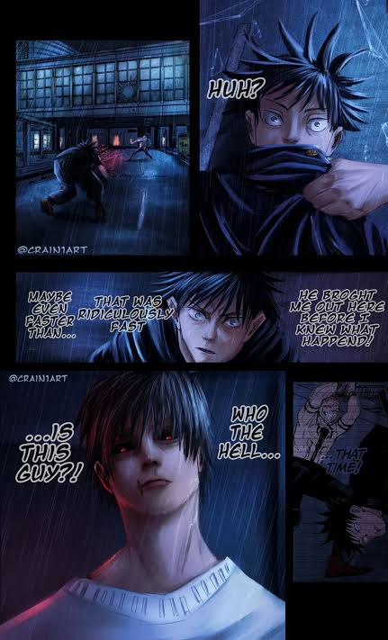
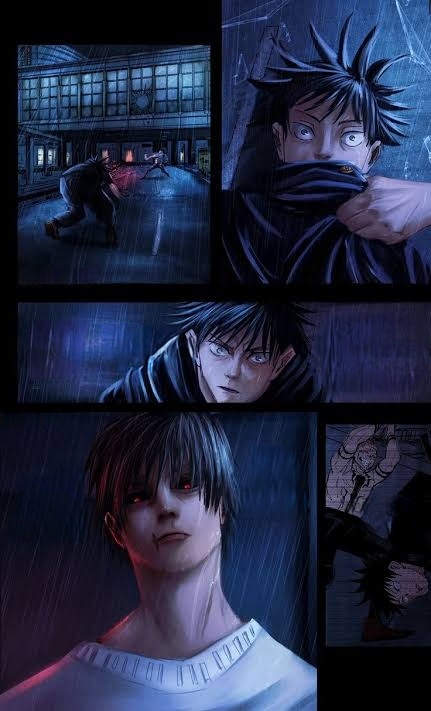

# 🌌 Axis Studio v4.0.0 — Titanium Engine

**The AI-powered manga cleaning studio. Detect. Clean. Export.**

[](../../releases)
[](LICENSE.txt)
[](../../releases)
[](#-requirements)

Axis Studio is a **complete rewrite** of Manga Cleaner. The Python prototype became a native C++/Qt application running on bare-metal **NVIDIA TensorRT** — the same inference stack that powers production AI services. What that means for you in practice: pages that used to take seconds now take **moments**, and whole chapters are cleaned with one click.



---

## ✨ What can it do?

- **🧹 One-click text & SFX removal** — the AI finds speech bubbles and sound effects on the page and paints them out with clean background, no Photoshop skills required.
- **✍️ Manual touch-ups** — brush, eraser, rectangle, lasso and magic-wand tools for the tricky spots, plus a **color brush** for redrawing art directly on the page.
- **🕳️ Transparency cleanup** — scans with cut-out bubbles? One click selects every transparent pixel so they can be inpainted too.
- **📚 Whole chapters in one go** — the **Wizard** processes an entire folder of pages automatically: detect → clean → export, hands-free.
- **🧾 Layered PSD export** — every page exports as a Photoshop file with the **original scan on the bottom layer and the cleaned page on top**, so you can compare, tweak, or revert anything later. JPG / PNG / WebP work too.
- **💾 Your work is never lost** — every page you clean or mask is remembered **per page**. Flip between pages, close the app, come back tomorrow: your work is still there. Untouched pages are never re-saved or re-exported.
- **↩️ Separate undo** — mask strokes and AI inpainting have their **own** undo histories (`Ctrl+Z` vs `Shift+Z`), just like Photoshop.
- **🖥️ Built for real gaming PCs** — the engine watches your VRAM, loads and unloads AI models by itself, and runs on cards as small as 4 GB.

---

## 🧠 The three AI engines (in plain English)

| Engine | What it does | Think of it as |
| :--- | :--- | :--- |
| **TextBPN++** | Scans the page and highlights every text and sound-effect region | *The spotter* |
| **LaMa** | Fills masked areas fast — perfect for speech bubbles and flat backgrounds | *The quick fixer* |
| **Moebius** | A latent-diffusion inpainter for complex areas: art behind text, patterns, gradients | *The artist* |

You don't have to choose. Leave the selector on **Auto** and Axis Studio picks the right engine for each region — fast where it can, careful where it must. Prefer control? Force **LaMa** or **Moebius** from the Studio panel.

---

## 🖼️ The workspace

**Studio** — the canvas where the magic happens. Paint a mask (or let detection do it), hit **Clean**, watch the text vanish.

**Gallery** — every loaded page in one list. Click to jump, or flip with **PageUp / PageDown**. Pages you edited keep their results.

**Wizard** — load a chapter folder, press **Run**, collect the cleaned pages. Optional ZIP packaging at the end.

| Gallery | Wizard |
| :---: | :---: |
|  |  |

---

## 🚀 Getting started

### 🎥 Video tutorial

Prefer watching over reading? A full video tutorial — installation, the model pack, and the complete cleaning workflow — is **coming soon!** It will be linked right here when it's live.

<!-- Embed template for when the tutorial is live:
[](https://youtu.be/VIDEO_ID)
-->

### Requirements

| | |
| :--- | :--- |
| **OS** | Windows 10 / 11, 64-bit |
| **GPU** | NVIDIA — GTX 16xx / RTX 20xx (Turing) or newer |
| **VRAM** | 4 GB minimum, **6 GB+ recommended** |
| **Driver** | A recent NVIDIA Game Ready / Studio driver |
| **Disk** | total of ~2 GB for the app + AI model pack |

> **Good news on VRAM:** every NVIDIA card newer than the GTX 16xx line already ships with at least 4 GB — so if your GPU is supported at all, you qualify.
>
> No NVIDIA GPU *yet*? The app will start, but AI cleaning needs one for now — **CPU and AMD support are in active development** (see the Roadmap below).

### 1. Download & unpack

Grab the latest release from the [**Releases**](../../releases) page and unzip it anywhere.

### 2. Add the AI model pack

Download `models.zip` from the same release and extract it **next to `axis_cleaner.exe`** so it looks like this:

```text
AxisStudio/
├── axis_cleaner.exe
└── models/
    ├── turing/          ← GTX 16xx / RTX 20xx
    ├── ampere/          ← RTX 30xx
    ├── blackwell/       ← RTX 50xx
    └── lovelace/        ← RTX 40xx
```

The app auto-detects your GPU and loads the matching pack — nothing to configure.

> **RTX 30xx / RTX 50xx owner?** The **Ampere** and **Blackwell** packs are being finalized and will land in a release within days. When they do, it's the same drop-in: extract, done.

### 3. Clean your first page

1. **File → Open Chapter…** and pick a folder of pages (or just some images).
2. Press **1** (or *Detect*) — watch the text get highlighted.
3. Press **2** (or *Clean*) — watch it disappear.
4. **File → Save** (or `Ctrl+S`) to export the open page. **Save All** exports the whole gallery.

That's the whole loop. 🎉

---

## 📸 Results

**Black & white manga**

| Original scan | Cleaned by Axis Studio v4.0.0 |
| :---: | :---: |
|  |  |

**Colored manhwa**

| Original scan | Cleaned by Axis Studio v4.0.0 |
| :---: | :---: |
|  |  |

---

## ⌨️ Keyboard shortcuts

| Key | Action |
| :--- | :--- |
| `1` / `2` | Detect text · Clean masked areas |
| `B` `E` `M` `L` `W` | Brush · Eraser · Rectangle · Lasso · Magic Wand |
| `H` | Hand tool (pan) — or just hold `Space` |
| `Alt + RMB drag` | Resize the brush on the fly |
| `[` / `]` | Smaller / bigger brush |
| `Alt + Wheel` | Zoom (anchored at the cursor) |
| `Ctrl + =` / `Ctrl + -` / `Ctrl + 0` | Zoom in · out · fit |
| `Ctrl + Z` / `Ctrl + Q` | Undo · redo **mask** strokes |
| `Shift + Z` / `Shift + Q` | Undo · redo **AI inpainting** |
| `PageDown` / `PageUp` | Next / previous page in the gallery |
| `Ctrl + S` | Save the **open page** |
| `Ctrl + O` / `Ctrl + Shift + O` | Open images · open chapter folder |
| `Tab` | Focus mode — hide everything but the canvas |

---

## ❓ FAQ

**Does it work with any manga language?**
Yes. The detector looks at the *shape* of text regions, not the words — Japanese, Korean, English, Chinese, sound effects, anything.

**Will my cleaned pages survive a restart?**
Yes. Edits are cached per page on disk (they live in `AppData\Local\AxisStudio\working_state`), and exporting only writes pages you actually touched. The cache keeps itself tidy — entries older than 30 days are pruned automatically, and **File → Clear Cached Page Edits** wipes it immediately if you want.

**Export gives me fewer files than pages — is that a bug?**
The opposite. Pages you never edited are skipped on purpose so you don't get a folder of duplicates. Run the Wizard or detect on a page first and it will export.

**AMD / Intel GPU? CPU mode?**
On the way — not a trade-off, a roadmap item. **CPU (OpenVINO) and AMD support are in active development** and planned for an upcoming release; the NVIDIA TensorRT engine ships first because it was ready first.

**Where are my settings?**
`settings.json` next to the app. If it ever gets corrupted, the app restores its own `settings.json.bak` backup automatically.

---

## 🗺️ Roadmap

| When | What |
| :--- | :--- |
| **Days away** | **Ampere** (RTX 30xx) and **Blackwell** (RTX 50xx) model packs |
| **~1 month** | **CPU support via OpenVINO** — cleaning without any NVIDIA GPU |
| **~1 to 3 months** | **AMD GPU support** |
| Coming soon | 🎥 **Full video tutorial** — installation, model pack, and the complete workflow |

Have a wish of your own? [Open an issue](../../issues) — the roadmap has community fingerprints all over it.

---

## 📜 License

Copyright © 2024–2026 NeTRuNNeRGLiTCH

Released under the **[Apache License 2.0](LICENSE.txt)**. In short: use it, modify it, ship it, sell work made with it — just keep the license notice and attribute. The old "no commercial use" policy of v3.x is gone; Apache 2.0 replaces it.

Scanlation groups: this tool exists for you. Whether your group takes donations or not, everything you produce with Axis Studio is yours.

---

## 🛠️ For Developers

<details>
<summary><strong>Architecture & building from source</strong> (click to expand)</summary>

Axis Studio is native C++20 on Qt 6.10.2 (MSVC x64) with OpenCV 4.12, ImageMagick 7.1.2 (Q16-HDRI, layered PSD writer) and NVIDIA TensorRT 11 for inference.

```
axis_cleaner/
├── axis_cleaner.{h,cpp}      ← main window, wiring, export orchestration
├── main.cpp                  ← app identity + working-state migration
├── src/
│   ├── core/
│   │   ├── pipeline/         ← task queue, studio & batch workers, VRAM budgeting
│   │   ├── state/            ← session_data (per-page persistence), history_stack
│   │   ├── image_ops/        ← mask tiling (no-overlap), inpaint engine router
│   │   ├── hardware/         ← DXGI/CUDA device scan, telemetry
│   │   ├── input/            ← global shortcut manager
│   │   └── diagnostics/      ← async logger (file filter: WARN+ + hardware banner)
│   ├── engine/
│   │   ├── trt_runtime.*     ← buffers, contexts, enqueueV3 wrapper
│   │   ├── trt_arch_detector ← GPU SM → model-pack routing
│   │   └── models/           ← textbpn / lama / moebius engines
│   ├── storage/              ← settings.json (debounced + .bak), PSD exporter
│   └── studio/               ← Qt UI: canvas, panels, tabs, dialogs
└── tools/trt_probe/          ← engine-pack inspector (IO shapes, profiles)
```

**Key internals**

- **Lazy VRAM residency** — engines are deserialized only when a stage needs them; an eviction policy (`ensure_vram`) fits TextBPN++'s ~5.3 GB activation footprint onto 8 GB cards. Per-engine persistence (Keep / Unload / Dynamic-60s) is user-configurable.
- **No-overlap tiling** — `mask_tiling.h` splits oversized mask components on the mask-quietest row/column (BFS), so a tile boundary can never slice a glyph and pasted outputs never overlap.
- **Auto routing** — `inpaint_router.h` histogram-analyzes the ring around each mask component; flat fills/gradients go to LaMa, structured art to Moebius.
- **Per-page persistence** — PNG image+mask pairs under `QStandardPaths::AppLocalDataLocation/working_state`, keyed by MD5 of the absolute file path, pruned at 30 days, size-guarded against stale state.

**Build**

1. Install Visual Studio 2022/18 (C++ workload, MSVC v143+), [Qt VS Tools](https://doc.qt.io/qtvstools/) with **Qt 6.10.2 MSVC2022** registered as `Qt_6.10.2`, CUDA 13.3 + cuDNN 9.24 + TensorRT 11.2.1.2, OpenCV 4.12.0 (world) and ImageMagick 7.1.2-Q16-HDRI.
2. Copy `axis_deps.template.props` → `axis_deps.props` and point the paths at your machine.
3. Build:

```powershell
$MSB = "C:\Program Files\Microsoft Visual Studio\18\Insiders\MSBuild\Current\Bin\MSBuild.exe"
& $MSB axis_cleaner.vcxproj -nologo -v:minimal -m -p:Configuration=Release -p:Platform=x64
```

Details, pitfalls and the TensorRT platform-lock warning live in **[portability.md](portability.md)**. TensorRT `.engine` files are only loadable on the TensorRT version + OS they were built for — rebuild packs from ONNX with your own `trtexec` if you're on a different stack, and verify any pack with `tools/trt_probe`.

</details>

---

<div align="center">

**Built for the scanlation community.** ⚡

If Axis Studio saves you hours, a ⭐ on the repo helps more than you think.

</div>
